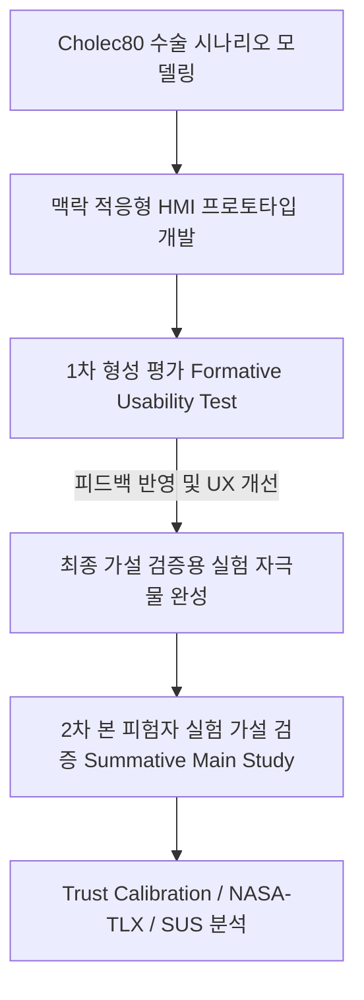

# [HMI 스투디오] 연구 진행 상황 보고서

* **연구 주제:** Context-Aware Information Display for Trust Calibration in Level 2 Human–AI Collaboration in Surgery: Incorporating Surgical Phase and AI State
* **과목명:** HMI 스투디오 (HMI Studio)
* **연구실:** 국민대학교 스마트 경험 디자인 연구실 (Smart Experience Design Lab)
* **작성자:** 예진윤 (yejinyoon)
* **작성일:** 2026년 5월 28일

---

## 1. 연구 배경 및 목적 (Introduction)

자율 기능을 포함한 수술 시스템에 대한 연구가 급격히 진행됨에 따라, 부분 자율(Level 2) 인간-AI 협업 환경에서 외과의는 AI의 자율적인 행동을 지속적으로 모니터링하며 적절한 시기의 개입 여부를 신속하게 판단해야 합니다. 그러나 AI 시스템에 대한 과도한 신뢰(Over-trust) 또는 불신(Under-trust)은 의사결정 및 개입의 지연, 혹은 불필요한 개입을 초래하여 수술 수행의 안전성과 효율성에 치명적인 영향을 미칠 수 있습니다. 

기존 HMI 연구들은 AI 시스템에 대한 사용자 신뢰 및 설명 가능성(Explainability)에 주목해 왔으나, 주로 정적인 정보 제시 방식을 전제로 하여 수술과 같이 매 순간 시간에 따라 급변하는 역동적인 맥락(Time-varying context)을 충분히 반영하지 못하는 한계가 있었습니다. 특히 수술의 단계(Surgical Phase)와 AI 상태(AI Confidence, Reasoning)를 통합적으로 고려한 HMI 설계가 사용자 신뢰 형성 및 조절(Trust Calibration)에 미치는 영향은 제한적으로 검증되어 왔습니다.

본 연구는 **수술 단계와 AI 상태를 반영한 맥락 인지 기반 정보 제시가 부분 자율(Level 2) 인간-AI 협업 환경에서 사용자 Trust Calibration과 의사결정 행동에 미치는 영향**을 분석 및 입증하는 것을 목적으로 합니다.

---

## 2. 연구 질문 (Research Questions)

본 연구의 가설 검증과 실험 설계를 관통하는 핵심 **연구 질문(RQs)**은 다음과 같이 세 가지로 정리됩니다.

* **RQ 1 (Trust Calibration - 신뢰 조절):** 
  HMI의 맥락 정보 제시 방식(A: Static, B: Phase-adaptive, C: Phase+AI-state adaptive)이 수술 환경에서 외과의의 **신뢰 조절(Trust Calibration)**과 적절한 개입 행동에 어떠한 영향을 미치는가?
  * *세부 질문 1-1:* AI의 상태 정보가 통합 제공될 때(Condition C), 정적인 UI(Condition A) 대비 사용자의 과도한 신뢰(Over-trust)로 인한 무비판적 승인이 감소하는가?
  * *세부 질문 1-2:* 위험 상황에서 의사의 수동 개입 반응 속도(Intervention Timing)와 의사결정의 정확도(Accuracy)가 적응형 HMI 환경에서 유의미하게 향상되는가?

* **RQ 2 (Confidence & Cognitive Load - 확신도 및 인지 부하):** 
  동적인 수술 단계별 정보와 AI의 판단 근거 제시가 의사결정의 **주관적 확신도(Decision Confidence)** 및 **인지 부하(Cognitive Load)**에 미치는 영향은 무엇인가?
  * *세부 질문 2-1:* 복잡한 수술 단계별 맥락과 AI 상태의 시각화가 사용자의 주관적 의사결정 확신도를 높여주는가?
  * *세부 질문 2-2:* 더 풍부한 맥락 정보를 제공하는 것이 다차원적 인지 부하(NASA-TLX: 정신적 요구량, 시간적 압박 등)를 오히려 경감시키는가, 혹은 추가적인 인지적 부담을 주는가?

* **RQ 3 (System Usability - 사용성):** 
  수술 맥락에 반응하여 레이아웃이 유동적으로 변화하는 적응형 HMI 설계가 범용적인 **시스템 사용성(System Usability Scale - SUS)** 평가에 어떠한 영향을 미치는가?
  * *세부 질문:* 수술 상황에 따른 정보의 강조 및 우선순위화(Condition B, C)가 정적인 구조(Condition A)에 비해 사용자가 지각하는 HMI의 전반적인 편의성과 시스템 신뢰성 점수를 향상시키는가?

---

## 3. 실험 설계 및 방법론 (Experimental Methods)

가설 검증을 위해 웹 기반 인터랙티브 수술 시뮬레이션 환경을 설계하였으며, 세 가지 서로 다른 정보 제시 조건(독립 변수)을 비교하는 피험자 내(Within-subject) 또는 피험자 간(Between-subject) 실험을 수행합니다.

### A. 실험 변수 설계
* **독립변수 (Independent Variables - HMI UI Conditions):**
  * **(A) Static Interface:** 고정된 정보 구조. 수술 단계나 AI 상태 변화에 관계없이 정적이고 동일한 형태의 정보만을 일관되게 제시.
  * **(B) Phase-adaptive Interface:** 수술 단계(Phase)에 맞추어 정보 구조가 적응적으로 변화하며, 현재 단계의 맥락과 고유 위험도 정보를 동적으로 제시.
  * **(C) Phase- and AI-state–adaptive Interface:** 수술 단계와 AI의 내부 상태(신뢰도 수준, 판단 근거 요약)를 모두 결합하여 정보를 가장 적응적으로 제시.
* **종속변수 및 측정 도구 (Dependent Variables & Measures):**
  * **Primary Outcome: Trust Calibration**
    * *Trust Scale:* 수술 종료 후 자동 설문을 통한 사용자의 주관적 신뢰 수준 측정
    * *Intervention Timing:* AI 이상 발생 시 사용자가 APPROVE 또는 INTERVENE를 결정하기까지 걸리는 반응 시간(Response Time)
    * *Decision Accuracy:* AI가 적절한 판단을 했을 때의 승인 여부 및 위험 상황에서의 개입 여부의 정확성
  * **Secondary Outcomes:**
    * *Decision Confidence:* 매 의사결정 이벤트 직후의 판단 확신도 측정
    * *Cognitive Load (NASA-TLX):* 수술 완료 직후의 다차원적 인지 부하 수준 측정
  * **Exploratory Measures:**
    * *System Usability (SUS):* 각 조건별 HMI의 범용 사용성 측정 (System Usability Scale 10문항)
    * *Qualitative Responses:* 사후 인터뷰를 통한 정성 피드백 수집

---

## 3. 현재까지의 개발 성과 (Formative & Stimuli Development)

본 가설 검증 실험을 온전하게 수행하기 위해, 실제 수술 시나리오와 연동되는 **고충실도(High-Fidelity) 인터랙티브 웹 시뮬레이션 실험물 및 평가 모듈**의 핵심 프레임워크 구현을 완료하였습니다. 

본 단계의 성과는 가설 검증 실험에 사용할 **"실험 자극물(Stimuli)의 완성도 확보"** 및 **"1차적 프로토타입 형성 평가(Formative Usability Test)"**에 초점을 맞추고 있습니다.

### A. 구현된 실험 자극물(Stimuli) 및 기능
1. **수술 단계 시뮬레이션 엔진:** Cholec80 표준 데이터셋을 기준으로 5개 수술 단계(P1~P5)와 위험 등급을 정의하고, 실제 복강경 수술 이미지와 동적 바이탈 사인을 시각화.
2. **맥락 인식 정보 컴포넌트 (Condition C):** AI가 특정 판단을 내릴 때 **Confidence(신뢰도 수치)**와 **Reasoning(판단 근거 설명)**을 UI에 적응적으로 레이아웃하여 제시하는 동적 렌더링 파이프라인 구축.
3. **사용자 인터랙션 수집 로직:** 의사의 승인(Approve) 및 개입(Intervene) 결정에 대응하는 물리 인터페이스 및 반응 속도(초 단위)/결정 데이터 실시간 적재 로그 시스템 구축.

### B. 프로토타입 형성 평가 (Formative Usability Evaluation) 모듈 개발
* **목적:** 실험 자극물로서의 HMI 디자인이 연구에서 의도한 시각적/인지적 단서들을 충분히 제공하고 있는지 본 실험 전에 파일럿 테스트 형태로 사전 검증하기 위함.
* **측정 차원:** 우측 슬라이드 아웃 패널을 통해 Situation Awareness(상황 인지), AI Transparency(투명성), Info Prioritization(정보 우선순위), Cognitive Load(인지 부하), Interaction Clarity(조작 명확성) 5대 휴리스틱 지표를 리커트 5점 척도로 평가하도록 연동 완료.
* **의의:** 본 휴리스틱 평가는 가설 검증(Summative) 자체와 구별되는 **"실험 자극물 정교화를 위한 사전 사용자 검증(User Test)"** 도구로 작동하며, 이를 통해 수집된 피드백은 최종 본 실험물 개선에 직접 기여함.

---

## 4. 향후 본 실험 및 분석 계획 (Summative Study & Future Work)

1. **대조군 실험 조건 완성 (Condition A, B 구현)**
   * Condition C의 완성도 높은 프로토타입 소스를 기반으로, 비교 실험군인 Condition A(Static)와 B(Phase-Adaptive)의 정보 제한 구조를 분리/구현하여 완벽한 피험자 테스트 환경 구축.
2. **피험자 모집 및 가설 검증 실험 (User Study) 실행**
   * 의과대학생, 외과 전공의 또는 HMI 전문가를 대상으로 3개 조건을 교차 체험하게 하는 피험자 내(Within-subject) 실험 진행.
3. **연구 가설 검증 통계 분석**
   * **가설 1:** 맥락 인식 정보(Condition C)를 제공받은 피험자가 Static(A) 조건 대비 더 정밀한 **Trust Calibration**을 보여줄 것이다 (과도한 승인 방지 및 개입 타이밍 단축 검증).
   * **가설 2:** 수술 단계 정보가 적응적으로 우선순위화되어 제공될 때(B, C 조건), 인지 부하(**NASA-TLX**)가 유의미하게 감소하고 시스템 사용성(**SUS**) 점수가 향상할 것이다.
   * 수집된 로그(반응 속도, 정확도)와 설문 데이터를 연계하여 ANOVA, t-test 등 다변량 통계 분석 수행 예정.
